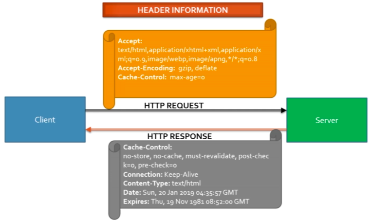

# Basics

## Gatling Unit Tests

These tests are under [test](../src/test/scala):

```bash
$ sbt gatling:test
```

And an example of running a specific test:

```bash
$ sbt "gatling:testOnly *Simulation1"
```

## Gatling Integration Tests

These tests are under [it](../src/it/scala):

```bash
$ sbt gatling-it:test
```

## Gatling Script Elements

- HTTP protocol configuration
- Header definition
- Scenario definition
- Simulation definition

## Simple Scenario



```scala
class DemoSimulation extends Simulation {
  // HTTP protocol configuration and header definition
  val httpProtocol: HttpProtocolBuilder = http
    .baseUrl("http://computer-database.gatling.io")
    .acceptHeader("text/html,application/xhtml+xml,application/xml;q=0.9,*/*;q=0.8")
    .doNotTrackHeader("1")
    .acceptLanguageHeader("en-US,en;q=0.5")
    .acceptEncodingHeader("gzip, deflate")
    .userAgentHeader("Mozilla/5.0 (Windows NT 5.1; rv:31.0) Gecko/20100101 Firefox/31.0")

  // Scenario definition
  val scn: ScenarioBuilder =
    scenario("DemoSimulation").exec(http("request_1") get "/").pause(5)

  // Simulation definition
  setUp(
    scn.inject(atOnceUsers(1))
  ).protocols(httpProtocol)
}
```

